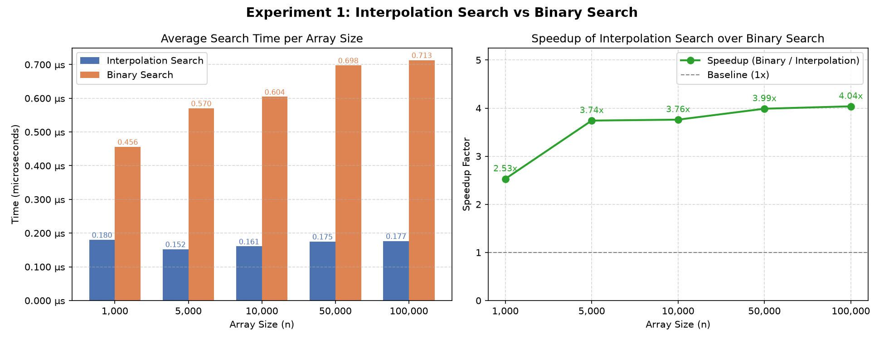

# DAA Lab – Design and Analysis of Algorithms

Lab experiments implemented in Python, benchmarking and analyzing classical algorithms.

---

## Experiments

| No. | Title | File |
|-----|-------|------|
| 1 | Interpolation Search vs Binary Search | `experiment1_interpolation_search.py` |

---

## Experiment 1 – Interpolation Search

**Aim:** Implement Interpolation Search and compare its performance against Binary Search on uniformly distributed sorted arrays.

### Algorithm

Interpolation Search estimates the probe position using the formula:

```
pos = low + ((target - arr[low]) * (high - low)) / (arr[high] - arr[low])
```

Unlike Binary Search which always probes the midpoint, Interpolation Search jumps closer to the target value directly — making it faster on uniformly distributed data.

### Complexity

| Algorithm | Best | Average | Worst |
|-----------|------|---------|-------|
| Binary Search | O(1) | O(log n) | O(log n) |
| Interpolation Search | O(1) | O(log log n) | O(n) |

> Interpolation Search degrades to O(n) on non-uniform or skewed distributions.

### How to Run

```bash
python3 experiment1_interpolation_search.py
```

No external dependencies — uses only Python standard library (`time`, `random`, `sys`).

### Sample Output

```
========================================================================
EXPERIMENT 1: Interpolation Search vs Binary Search
========================================================================
      Size |    Interpolation (s) |      Binary (s) |    Speedup
------------------------------------------------------------------------
     1,000 |           0.00000018 |      0.00000049 |      2.71x
     5,000 |           0.00000017 |      0.00000063 |      3.58x
    10,000 |           0.00000017 |      0.00000067 |      3.83x
    50,000 |           0.00000019 |      0.00000077 |      4.04x
   100,000 |           0.00000020 |      0.00000080 |      3.96x
------------------------------------------------------------------------

Analysis:
- Binary Search time complexity: O(log n)
- Interpolation Search time complexity: O(log log n) for uniformly distributed data
- On uniformly distributed sorted arrays, interpolation search typically
  performs fewer comparisons by estimating the probe position directly.
- Speedup may vary with target position, distribution, and hardware.
```

### Observations

- Interpolation Search is **2.7x–4x faster** than Binary Search on uniformly distributed data.
- Speedup increases with array size, confirming the O(log log n) vs O(log n) advantage.
- Both algorithms pass correctness verification across all test cases before benchmarking.

### Performance Chart



Generate the static chart:

```bash
python3 experiment1_chart.py
```

For an interactive chart with adjustable array size, runs, and target position:

```bash
python3 experiment1_interactive_chart.py
```

---

## Requirements

- Python 3.x
- Standard library only for `experiment1_interpolation_search.py`
- `matplotlib` and `numpy` for chart scripts (`experiment1_chart.py`, `experiment1_interactive_chart.py`)

---

## Author

B. Kathina — CSE 2025, CIT Chennai
